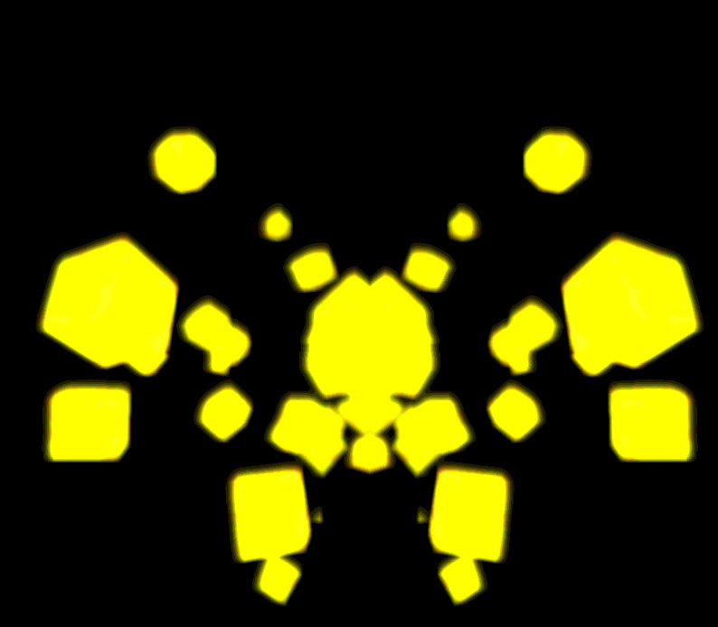
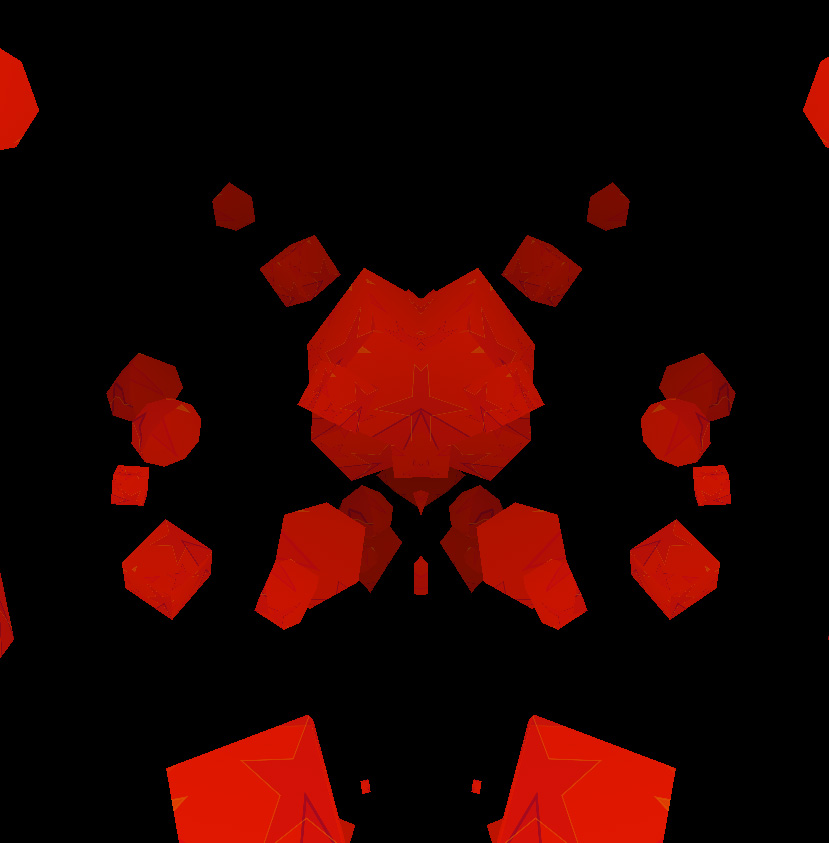
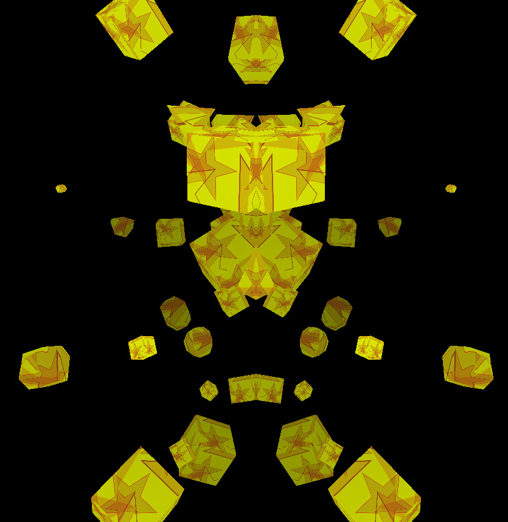
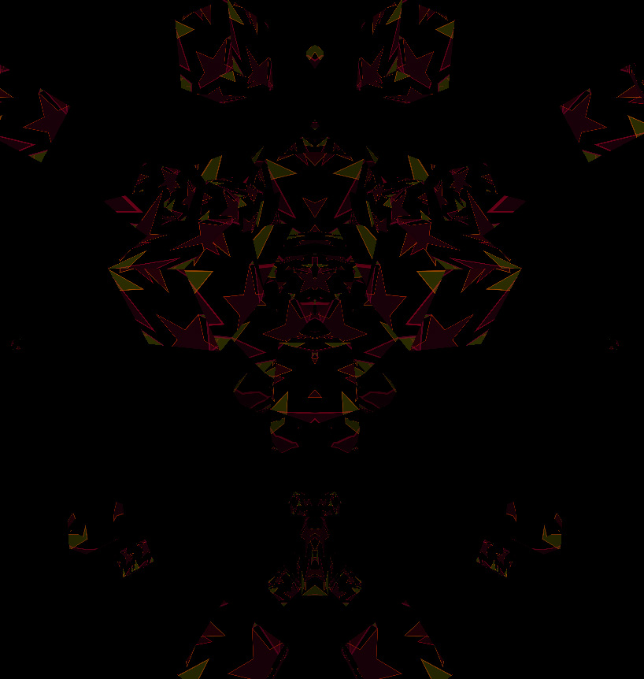

ds.GlamShader
(DemoScene).GlamShader
=============
<pre>
  ___  __     __   _  _ ____ _  _  __  ____ ____ ____ 
 / __)(  )   / _\ ( \/ ) ___) )( \/ _\(    (  __|  _ \
( (_ \/ (_/\/    \/ \/ \___ ) __ (    \) D () _) )   /
 \___/\____/\_/\_/\_)(_(____|_)(_|_/\_(____(____|__\_)

 
</pre>

	
Simple threeJS / GLAM example using shaders, web audio, processingJS, hypeframework and soundcloud.
	 

